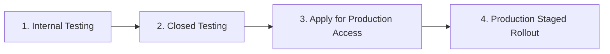

# Google Play Store Release & Submission Guidelines
### App: **NestPilot - PG Collector** (TitanStay Collection Agent)
**Package Name (`applicationId`):** `com.titanstay.collector`  
**Framework:** Flutter (Android API 24+ / Target SDK 34/35)

---

## Table of Contents
1. [Pre-Flight Technical Fixes & Edge Cases Resolved](#1-pre-flight-technical-fixes--edge-cases-resolved)
2. [Release Keystore Generation & Setup](#2-release-keystore-generation--setup)
3. [Building the Production Android App Bundle (.aab)](#3-building-the-production-android-app-bundle-aab)
4. [Critical Google Play Edge Cases & Policies](#4-critical-google-play-edge-cases--policies)
5. [Store Listing Metadata (Ready-to-Copy)](#5-store-listing-metadata-ready-to-copy)
6. [Store Graphic Assets Specifications](#6-store-graphic-assets-specifications)
7. [Play Console Declarations & Questionnaires](#7-play-console-declarations--questionnaires)
8. [Data Safety Form Exact Mappings](#8-data-safety-form-exact-mappings)
9. [Account Deletion Requirement](#9-account-deletion-requirement)
10. [Release Tracks & Rollout Strategy](#10-release-tracks--rollout-strategy)

---

## 1. Pre-Flight Technical Fixes & Edge Cases Resolved

Before building for release, the following critical configuration fixes have already been applied to the codebase:

| Component | Status | Description |
| :--- | :--- | :--- |
| **Application ID** | ✅ Fixed | Changed from `com.example.collection_agent` to `com.titanstay.collector`. (*Google Play rejects any app with `com.example`*). |
| **Internet Permission** | ✅ Fixed | Added `<uses-permission android:name="android.permission.INTERNET"/>` and `ACCESS_NETWORK_STATE` to `src/main/AndroidManifest.xml`. (*Previously only present in debug manifest, which would break network in release mode*). |
| **App Name Label** | ✅ Fixed | Set `android:label="NestPilot"` in `AndroidManifest.xml` (was raw `collection_agent`). |
| **Cloud Backup Rule** | ✅ Fixed | Set `android:allowBackup="false"` to prevent tenant PII and auth tokens from leaking to personal Google Drive backups. |
| **Release Signing** | ✅ Configured | `build.gradle.kts` configured to dynamically load `key.properties` for release builds with debug fallback. |
| **ProGuard / R8** | ✅ Configured | Created `proguard-rules.pro` protecting Flutter engine, Flutter Secure Storage, and JSON serialization. |
| **Sensitive Logging** | ✅ Fixed | Gated `AppLogger` behind `kDebugMode` to avoid leaking passcodes and auth tokens to system logcat in release builds. |

---

## 2. Release Keystore Generation & Setup

Google Play requires that every release build uploaded to the console is signed with a cryptographic private key.

### Step 2.1: Generate the Keystore File
Open PowerShell or Command Prompt, navigate to your machine's secure keys folder (or the `collection_agent/android` directory), and run:

```bash
keytool -genkey -v -keystore upload-keystore.jks -keyalg RSA -keysize 2048 -validity 10000 -alias upload
```

You will be prompted for:
1. Keystore password (choose a strong password and save it in a password manager).
2. First/Last name, Organization, City, State, Country code.
3. Key password.

> [!WARNING]
> **NEVER LOSE THIS KEYSTORE FILE OR PASSWORD!**  
> Store a backup copy of `upload-keystore.jks` in a secure cloud storage/vault (1Password, Bitwarden, or company vault). If you lose this key, you will not be able to update your app unless Play App Signing reset is approved by Google support.

### Step 2.2: Configure `key.properties`
1. Navigate to `collection_agent/android/`.
2. Create a file named `key.properties` (this file is already in `.gitignore` and must **never** be committed to Git).
3. Fill in the credentials:

```properties
storePassword=YOUR_KEYSTORE_PASSWORD
keyPassword=YOUR_KEY_PASSWORD
keyAlias=upload
storeFile=../upload-keystore.jks
```
*(If your keystore is in `android/app/`, use `storeFile=upload-keystore.jks`)*.

---

## 3. Building the Production Android App Bundle (.aab)

Google Play requires **Android App Bundle (.aab)** format rather than `.apk`.

### Step 3.1: Bump Version in `pubspec.yaml`
Before each Play Store upload, update the `version:` in `collection_agent/pubspec.yaml`:
```yaml
version: 1.0.0+1
```
- Format: `versionName+versionCode`
- For subsequent releases: `1.0.1+2`, `1.0.2+3`, etc. Google Play **strictly requires a higher `versionCode`** on every new upload.

### Step 3.2: Run the Production Build Command
Run the build command with code obfuscation and symbol splitting enabled for maximum security and reduced crash reporting overhead:

```bash
flutter build appbundle --release --obfuscate --split-debug-info=build/app/outputs/symbols
```

Output location:
```
collection_agent/build/app/outputs/bundle/release/app-release.aab
```

### Step 3.3: Test Locally Before Uploading
To verify the release build works smoothly on a physical test device before submitting:
```bash
flutter build apk --release
flutter install --release
```

---

## 4. Critical Google Play Edge Cases & Policies

### Edge Case 1: Google App Reviewer Login Access ("Inaccessible Content" Rejection)
- **Why apps get rejected:** Google Play reviewers test apps from emulators or physical review devices in the US/EU. If your app requires login and you do not provide active credentials, they will immediately reject it with: *"App Review - Inaccessible content"*.
- **Mandatory Action:** In Play Console ➔ **App access**, select **"All or some functionality is restricted"** and add instructions:
  - **Phone Number:** `+91 96455 54566` (or your staging test phone)
  - **Passcode:** `1234`
  - **Explanation:** *"Enter test phone number and passcode to log in as a property collection agent. This allows review of room occupancy, tenant details, payment collection flows, and transaction logs."*

### Edge Case 2: 20 Testers for 14 Days (Personal Developer Accounts)
- **Google Policy:** For all personal developer accounts created after November 13, 2023, Google requires at least **20 testers opted-in for at least 14 consecutive days** in the **Closed Testing** track before you can apply for Production access.
- **Rules to avoid rejection:**
  1. Testers must opt in via the Google Play test link.
  2. Testers should keep the app installed and open it periodically during the 14 days.
  3. You must collect feedback (e.g. via Google Form or in-app feedback).
  4. Once 14 days elapse, a questionnaire will unlock in Play Console asking about your testing process before Google grants Production release rights.

### Edge Case 3: Financial Services & Loan Policy
- **Why this matters:** The app handles rent payments, cash collection, UPI, and payment logs.
- **Risk:** Google algorithms might mistakenly flag the app under the "Personal Loans" or "Credit Facilitation" policy, which has heavy regulatory requirements in India.
- **Solution:** In the Play Console declaration, clarify:
  - *"NestPilot is an internal business property management tool for PG (paying guest) operators and collection agents to record offline/online rent payments received from tenants. It does not issue loans, credit, or financial lending products."*

### Edge Case 4: Target SDK Compliance
- Google Play requires all new apps to target **API level 34 (Android 14)** or **API level 35 (Android 15)**.
- Flutter 3.44+ automatically targets the required SDK when built with up-to-date Android Gradle plugins.

---

## 5. Store Listing Metadata (Ready-to-Copy)

### App Name (Max 30 characters)
```
NestPilot - PG Collector
```

### Short Description (Max 80 characters)
```
Smart PG rent collection and tenant management for property collection agents.
```

### Full Description (Up to 4,000 characters)
```text
NestPilot is a streamlined property management and rent collection application designed specifically for PG (Paying Guest) and hostel collection agents.

Simplify your daily field collections, monitor room occupancy, and record tenant payments with speed, accuracy, and full transparency.

KEY FEATURES:

🏢 Room & Bed Management
• View complete block-by-block and floor-by-floor room layouts.
• Instantly check bed occupancy status: occupied vs. vacant.
• Access tenant profiles, joining dates, and assigned rooms.

💰 Fast Rent Collection
• Collect full or partial payments in seconds.
• Multiple payment modes supported: Cash, UPI, Card, Net Banking, and Bank Transfer.
• Automatic calculation of outstanding dues and balance updates.

📋 Tenant Information at Your Fingertips
• Quick access to tenant emergency contacts, IDs, and joining details.
• Real-time payment history tracking for every resident.

📊 Real-Time Collection History
• Daily and grouped transaction logs (Today, Yesterday, Custom).
• Filter transactions by payment channels (Cash, UPI, Cards, Bank).
• Instant audit-ready records synced securely with your PG Admin backend.

🔒 Secure & Reliable
• Encrypted data transmission via secure HTTPS endpoints.
• Role-based agent access with secure passcode authentication.
• Local secure storage for tokens and credentials.

Note: NestPilot is an internal tool for registered property managers and authorized collection agents. Contact your property administrator for login access.
```

---

## 6. Store Graphic Assets Specifications

| Asset | Dimensions | Format | Requirements / Guidelines |
| :--- | :--- | :--- | :--- |
| **App Icon** | 512 x 512 px | PNG (32-bit) | Max 1024 KB. No transparent background. Crisp, rounded-square icon with NestPilot branding. |
| **Feature Graphic** | 1024 x 500 px | JPG or PNG (24-bit) | No transparency. Max 15 MB. Prominently display "NestPilot - PG Collection Agent" with modern UI mockup. |
| **Phone Screenshots** | Min 2, Max 8 | JPG or PNG | 16:9 or 9:16 aspect ratio (e.g. 1080 x 1920 or 1080 x 2400 px). Showcase: 1) Agent Login, 2) Room & Bed Overview, 3) Collect Payment Bottom Sheet, 4) Collection History & Filters. |
| **Tablet Screenshots** | 7-inch & 10-inch | JPG or PNG | Optional if targeting phones only, but recommended for tablet listing quality. |

---

## 7. Play Console Declarations & Questionnaires

When filling out the **App Content** section in Google Play Console:

| Section | Selection / Answer |
| :--- | :--- |
| **Privacy Policy** | Provide valid hosted URL (e.g., `https://titanstay.com/privacy-policy`). Must explicitly mention collecting tenant details, phone numbers, and payment records for property operations. |
| **App Access** | Select *"All or some functionality is restricted"* and provide reviewer credentials (Phone: `+91 96455 54566`, Passcode: `1234`). |
| **Ads** | Select **"No, my app does not contain ads"**. |
| **Content Rating (IARC)** | Category: **Utility / Productivity / Business**. Violence/Sex/Profanity: **No**. User interaction: **No**. Result: **PEGI 3 / Everyone**. |
| **Target Audience** | **18 and above**. Do **NOT** select children/families under 13 (avoids strict Families Policy constraints). |
| **News App** | **No**. |
| **COVID-19 Tracing** | **No**. |
| **Government Apps** | **No**. |
| **Financial Features** | Select *"My app does not provide financial services/loans"* OR specify *"B2B internal property rent collection record keeper"*. |

---

## 8. Data Safety Form Exact Mappings

Google Play strictly audits the **Data Safety** section against the permissions and API calls in your app:

### Collected Data Types

1. **Personal Info**:
   - **Name**: Collected for tenant & agent identification. (Ephemeral / Synced with backend, Encrypted in transit).
   - **Phone Number**: Collected for login verification and tenant record keeping.
   - **Email Address**: Optional / profile info.
2. **Financial Info**:
   - **Payment Info / Purchase History**: Rent payment amounts, dates, and payment methods (Cash/UPI/Card). Handled for property administration purposes.
3. **App Info and Performance**:
   - **Diagnostics**: Error logs / connection diagnostics.

### Data Practices
- **Data Encrypted in Transit:** **Yes** (all communications occur over TLS/HTTPS).
- **Data Deletion Request:** **Yes** (users/tenants can request deletion of account and records by contacting the administrator/support).

---

## 9. Account Deletion Requirement

Google Play Policy mandates that if an app allows account creation or login, users must be provided with:
1. **In-app account deletion** or data deletion request option (or request to admin).
2. **A public web link** where users can request account and associated data deletion without reinstalling the app (e.g. `https://titanstay.com/delete-account`).

---

## 10. Release Tracks & Rollout Strategy

Follow this staged release sequence:



1. **Internal Testing Track (Day 1)**:
   - Upload `.aab` to test on your internal development and QA devices immediately (no Google review delay).
2. **Closed Testing Track (Days 2 to 16)**:
   - Required if using a new personal developer account (20 testers for 14 continuous days).
   - Gather real agent feedback in the field.
3. **Production Staged Rollout (Launch Day)**:
   - **10% Rollout:** Monitor crash logs and ANR rates on Google Play Console for 24 hours.
   - **20% Rollout:** Verify backend server load and API responsiveness.
   - **50% Rollout:** Expand to more agents.
   - **100% Full Release:** Full public availability.
